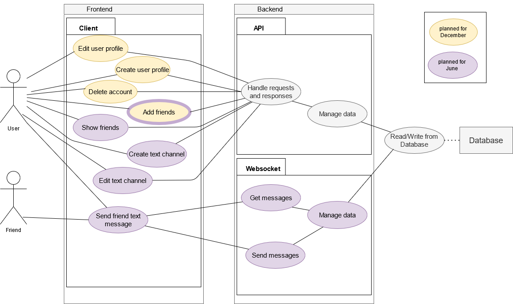

# Software Architecture Document

# Table of Contents

- [Introduction](#1-introduction)
    - [Purpose](#11-purpose)
    - [Scope](#12-scope)
    - [Definitions, Acronyms and Abbreviations](#13-definitions-acronyms-and-abbreviations)
    - [References](#14-references)
    - [Overview](#15-overview)
- [Architectural Representation](#2-architectural-representation)
- [Architectural Goals and Constraints](#3-architectural-goals-and-constraints)
- [Use-Case View](#4-use-case-view)
    - [Use-Case Realizations](#41-use-case-realizations)
- [Logical View](#5-logical-view)
    - [Overview](#51-overview)
    - [Architecturally Significant Design Packages](#52-architecturally-significant-design-packages)
- [Process View](#6-process-view)
- [Deployment View](#7-deployment-view)
- [Implementation View](#8-implementation-view)
    - [Overview](#81-overview)
    - [Layers](#82-layers)
- [Data View](#9-data-view)
- [Size and Performance](#10-size-and-performance)
- [Quality](#11-qualitymetrics)

## 1. Introduction

### 1.1 Purpose

This document provides a comprehensive architectural overview of the system, using a number of different architectural
views to depict different aspects of the system. It is intended to capture and convey the significant architectural
decisions which have been made on the system.

### 1.2 Scope

The document describes the architecture of the Ceangal-Messenger project. Including Use Cases, structure and
dependencies.

### 1.3 Definitions, Acronyms and Abbreviations

| Abbrevation | Description                            |
| ----------- | -------------------------------------- |
| HTML        | Hypertext Markup Language              |
| CSS         | Cascading Style Sheets                 |
| MVC         | Model View Controller                  |
| n/a         | not applicable                         |

### 1.4 References

| Title                                                                                                                               |     Date     | Publishing organization   |
| ------------------------------------------------------------------------------------------------------------------------------------|:------------:| ------------------------- |
| [Ceangal-Messenger Blog](https://ceangalmessenger.wordpress.com/)                                                                            | 2020-12-03   | Ceangal-Messenger Team            |
| [Code Repository](https://github.com/LorenzSeufert/CeangalMessenger---Code)                                                          | 2020-12-03   | Ceangal-Messenger Team             |
| [Documentation Repository](https://github.com/LorenzSeufert/CeangalMessenger---Documentation)                                                      | 2020-12-03   | Ceangal-Messenger Team              |
| [Use Cases](https://github.com/LorenzSeufert/CeangalMessenger---Documentation/tree/main/UseCases)                                     | 2020-12-03  | Ceangal-Messenger Team  |
| [SRS](https://github.com/LorenzSeufert/CeangalMessenger---Documentation/blob/main/Software_Requirements_Specification.md)                                                      | 2020-12-03   | Ceangal-Messenger Team              |

### 1.5 Overview

The following contains the Architectural Representation, Goals and Constraints, the Use Case View and the Logical,
Process, Deployment, Implementation and Data views.

## 2. Architectural Representation

We are using Electron for the client and Kotlin for the Server implementation. Our database will be made with MariaDB. Spring will be used for the communication between the UI and the database.

## 3. Architectural Goals and Constraints

For the Frontend we are using the Electron Framework, which allows us to implement nice Desktop Applications with HTML,
CSS and JavaScript.

In the Backend and Server we are using Kotlin with the Spring Framework.

For our database we are using MariaDB.

## 4. Use-Case View

### 4.1 Use-Case Realizations

In the following you can see Activity Diagrams for two Use Cases:

-Create Text Channel Diagram:

-Edit User Profile Diagram:

## 5. Logical View

We are using the MVC Architecture for our project.

### 5.1 Overview

### 5.2 Architecturally Significant Design Packages

TODO

## 6. Process View

TODO

## 7. Deployment View

TODO

## 8. Implementation View

TODO

### 8.1 Overview

TODO

### 8.2 Layers

TODO

## 9. Data View

## 10. Size and Performance

n/a

## 11. Quality/Metrics

TODO
