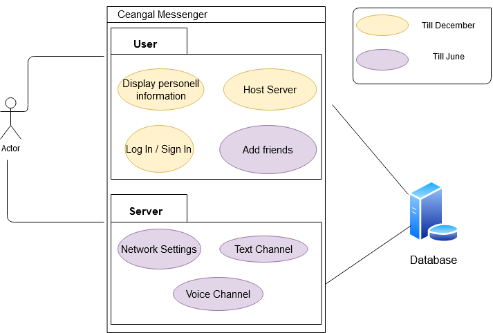

# Ceangal-Messenger -- Software Requirements Specification

- [1. Introduction](#1-introduction)

    - [1.1 Purpose](#11-purpose)
    - [1.2 Scope](#12-scope)
    - [1.3 Definitions, Acronyms and Abbreviations](#13-definitions-acronyms-and-abbreviations)
    - [1.4 References](#14-references)
    - [1.5 Overview](#15-overview)

- [2. Overall Description](#2-overall-description)

    - [2.1 Vision](#21-vision)
    - [2.2 Use Case Diagram](#22-use-case-diagram)
    - [2.3 Technology Stack](#23-technology-stack)

- [3. Specific Requirements](#3-specific-requirements)

    - [3.1 Functionality](#31-functionality)

        - [3.1.1 Use Cases](#311-use-cases)
            - [3.1.1.1 Add Friend](#3111-add-friend)
            - [3.1.1.2 Create Text Channel](#3112-create-text-channel)
            - [3.1.1.3 Create User Profile](#3113-create-user-profile)
            - [3.1.1.4 Edit User Profile](#3114-edit-user-profile)
            - [3.1.1.5 Host Local Server](#3115-delete-account)
            - [3.1.1.6 Edit Text Channel](#3116-edit-text-channel)
            - [3.1.1.7 Send private message](#3117-send-friend-private-message)
            - [3.1.1.8 Show friends](#3118-show-friends)

    - [3.2 Usability](#32-usability)

    - [3.3 Reliability](#33-reliability)

    - [3.4 Performance](#34-performance)

    - [3.5 Supportability](#35-supportability)

    - [3.6 Design Constraints](#36-design-constraints)

    - [3.7 Online User Documentation and Help System Requirements](#37-online-user-documentation-and-help-system-requirements)

    - [3.8 Purchased Components](#38-purchased-components)

    - [3.9 Interfaces](#39-interfaces)

        - [3.9.1 User Interfaces](#391-user-interfaces)
        - [3.9.2 Hardware Interfaces](#392-hardware-interfaces)
        - [3.9.3 Software Interfaces](#393-software-interfaces)
        - [3.9.4 Communications Interfaces](#394-communications-interfaces)

    - [3.10 Licensing Requirements](#310-licensing-requirements)

    - [3.11 Legal, Copyright and other Notices](#311-legal-copyright-and-other-notices)

    - [3.12 Applicable Standards](#312-applicable-standards)

- [4. Supporting Information](#4-supporting-information)

## 1. Introduction

### 1.1 Purpose

This Software Requirements Specification (SRS) describes all specifications for the application "Ceangal Messenger". The
project is a little social chat app with self deployable servers, it should prevent your data to be stored by other
companys.

### 1.2 Scope

The project is going to be realized as a Desktop Application. Some functions are:

- Add friends
- Personal user profile
- Chat with friends

### 1.3 Definitions, Acronyms and Abbreviations

| Term     |                                     |
| -------- | ----------------------------------- |
| **SRS**  | Software Requirements Specification |
| **n/a**  | Not Applicable                      |
| **TBD**  | To Be Determined                    |

### 1.4 References

| Title                                                                                                 | Date       |
| ----------------------------------------------------------------------------------------------------- | ---------- |
| [Blog](https://ceangalmessenger.wordpress.com/)                                                       | 15/10/2020 |
| [GitHub --Code](https://github.com/LorenzSeufert/CeangalMessenger---Code)                             | 15/10/2020 |
| [GitHub --Documentation](https://github.com/LorenzSeufert/CeangalMessenger---Documentation)           | 15/10/2020 |
| [Use Case Diagram](https://github.com/LorenzSeufert/CeangalMessenger---Documentation/blob/main/UseCaseDiagram.png)                                                                                  | 15/10/2020 |

### 1.5 Overview

The following chapter is an overview about this project. Chapter number three is about the specific requirements and
goes more in detail. At the end are the supporting informations.

## 2. Overall Description

### 2.1 Vision

Ceangal Messenger is a little social chat app with self deployable servers. Every user has a profile with personal
information. You should be able to add friends and write with them in a private text Channel. Later on we want to
implement self deployable servers with voice and text channels.

### 2.2 Use Case Diagram

### 2.3 Technology Stack

- Kotlin
- Electron and ExpressJs/NodeJs
- Bootstrap
- Spring Boot and Spring Data JPA
- MariaDB adn H2 DB

## 3. Specific Requirements

### 3.1 Functionality

In this section you can see our different use cases.

#### 3.1.1 Use Cases

##### 3.1.1.1 Add Friend

You can find the use
case [here](https://github.com/LorenzSeufert/CeangalMessenger---Documentation/blob/main/UseCases/AddFriendUseCase.md)

##### 3.1.1.2 Create Text Channel

You can find the use
case [here](https://github.com/LorenzSeufert/CeangalMessenger---Documentation/blob/main/UseCases/CreateTextChannelUseCase.md)

##### 3.1.1.3 Create User Profile

You can find the use
case [here](https://github.com/LorenzSeufert/CeangalMessenger---Documentation/blob/main/UseCases/CreateUserProfileUseCase.md)

##### 3.1.1.4 Edit User Profile

You can find the use
case [here](https://github.com/LorenzSeufert/CeangalMessenger---Documentation/blob/main/UseCases/EditUserProfileUseCase.md)

##### 3.1.1.5 Delete Account

You can find the use
case [here](https://github.com/LorenzSeufert/CeangalMessenger---Documentation/blob/main/UseCases/DeleteAccountUseCase.md)

##### 3.1.1.6 Edit Text Channel

You can find the use
case [here](https://github.com/LorenzSeufert/CeangalMessenger---Documentation/blob/main/UseCases/EditTextChannelUseCase.md)

##### 3.1.1.7 Send friend private message

You can find the use
case [here](https://github.com/LorenzSeufert/CeangalMessenger---Documentation/blob/main/UseCases/SendFriendsPrivateTextMessageUseCase.md)

##### 3.1.1.8 Show friends

You can find the use
case [here](https://github.com/LorenzSeufert/CeangalMessenger---Documentation/blob/main/UseCases/ShowFriendsUseCase.md)

### 3.2 Usability

The app should be easy to understand and be minimalistic.

### 3.3 Reliability

The backend should be available any time.

### 3.4 Performance

It should run on every desktop device and have short loading times.

### 3.5 Supportability

You can easily start your own backend server. It depends on you if the service is available or not.

### 3.6 Design Constraints

It should be minimalistic and lightweight.

### 3.7 Online User Documentation and Help System Requirements

You can find out Doku here [GitHub Documentation](https://github.com/LorenzSeufert/CeangalMessenger---Documentation)

### 3.8 Purchased Components

We only use open-source software so nothing is purchased

### 3.9 Interfaces

#### 3.9.1 User Interfaces

The interaction with the user is provided through the Electron application.

#### 3.9.2 Hardware Interfaces

(n/a)

#### 3.9.3 Software Interfaces

We want to use a REST API to communicate between client and backend server.

#### 3.9.4 Communications Interfaces

(n/a)

### 3.10 Licensing Requirements

(n/a)

### 3.11 Legal, Copyright and other Notices

The logo is licensed to the Ceangal Messenger Team. We do not take responsibilty for any incorrect data or errors in the
application.

### 3.12 Applicable Standards

We will follow the standard code conventions for JavaScript and Kotlin.

## 4. Supporting Information

For more information look into our [blog](https://ceangalmessenger.wordpress.com/)
