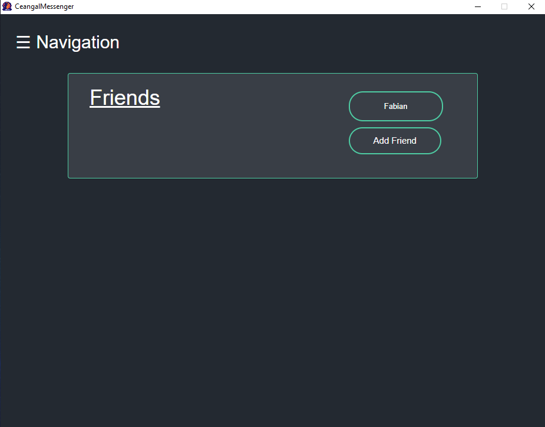
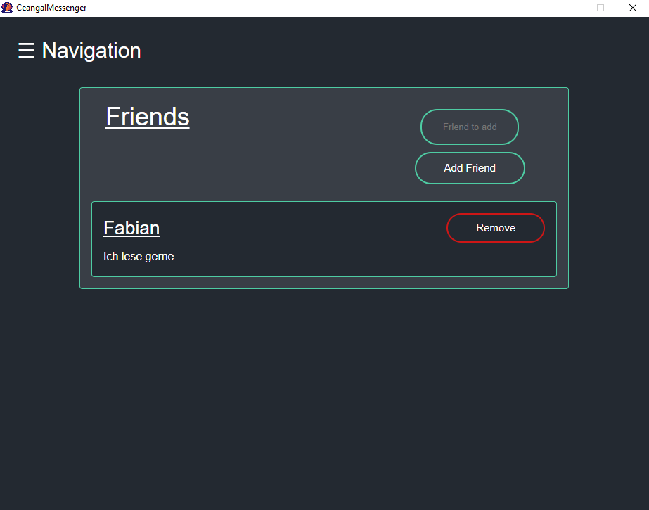

# 1 Use-Case Specification: Add friend

## 1.1 Brief Description

The User is sending a friend request by searching his or her username via the search mask on the add friend page. If the
username exits, the user can send a friend request by clicking the "Add" button.

## 1.2 Mockup/Screenshot

# 2 Flow of Events

## 2.1 Basic Flow

- User clicks on "Friends" button
- Redirect to friends page
- User clicks on "Add friend" button
- Redirect to "Add friend" page
- User types in the username of the searched user in the search bar
- User presses "Enter"
- A list is shown of all the users which names contain the entered string
- Next to the usernames in the list are "Add" buttons
- User clicks on the "Add" button of the friend he wants to add
- Confirmation is shown

### 2.1.1 Activity Diagram

### 2.1.2 .featureFile

TODO

## 2.2 Alternative Flows

(n/a)

# 3 Special Requirements

The user exists the client wants to add.

# 4 Preconditions

The user has to be logged in to the application.

# 5 Postconditions

The user is added to the friendlist of the client.

# 6 Function Points

