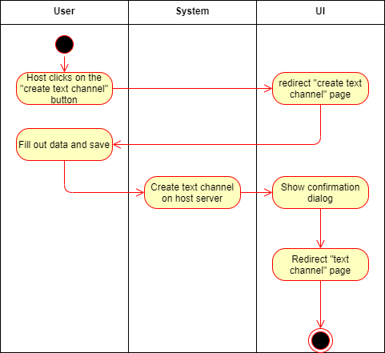

# 1 Use-Case Name
Create text channel

## 1.1 Brief Description
Every host of a server can create a text channel
- The creator has to enter a name for the text channel
- The creator can add a description to the text channel
- Everyone can write in the text channel if he is part of the server.

# 2 Flow of Events
## 2.1 Basic Flow
- Host clicks on "create text channel" button
- Redirect to "create text channel" page
- Creator fills out data
- Creator clicks on "save"
- Confirmation Dialog is shown
- Redirect on "text channel" page

### 2.1.1 Activity Diagram


### 2.1.2 Mock-up


### 2.1.3 Narrative
```gherkin
Feature: edit user profile

  As a signed in user
  i want to create a text channel

  Background:
    And I am on the main page

  Scenario: click "create text channel" button
    Given I am signed in with username "USER" and password "PASSWORD"
    And I am on the "main" page
    When I press the "create text channel" button
    Then I am on the "create text channel" page

  Scenario: fill out data
    Given I am signed in with username "USER" and password "PASSWORD"
    And I am on the "create text channel" page
    I have to fill out the "name" field
    And I can fill out the "description" field
    When I press the "save" button
    Then a confirmation Dialog is shown
    Then I am on the "text channel" page
```

## 2.2 Alternative Flows
(n/a)

# 3 Special Requirements
(n/a)

# 4 Preconditions
## 4.1 Login
The user has to be logged in to the system.

# 5 Postconditions
(n/a)

# 6 Extension Points
(n/a)
