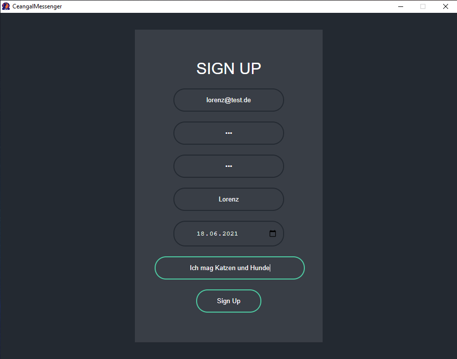

# 1 Use-Case Specification: Create user profile

## 1.1 Brief Description

Create a user profile to register for the application. The following informations have to be specified:

- E-Mail
- password 2x
- username
- picture
- birthdate
- description

## 1.2 Mockup/Screenshot

# 2 Flow of Events

## 2.1 Basic Flow

- User clicks on "Sign Up" button
- Redirect to "Sign Up" page
- User inserts his data
- User clicks on "Sign Up" button
- Confirmation Dialog is shown
- Redirect to "Log In" page

### 2.1.1 Activity Diagram

### 2.1.2 .featureFile

TODO

## 2.2 Alternative Flows

(n/a)

# 3 Special Requirements

The user needs a valid email address.

# 4 Preconditions

(n/a)

# 5 Postconditions

The user is created in the application.

# 6 Function Points

