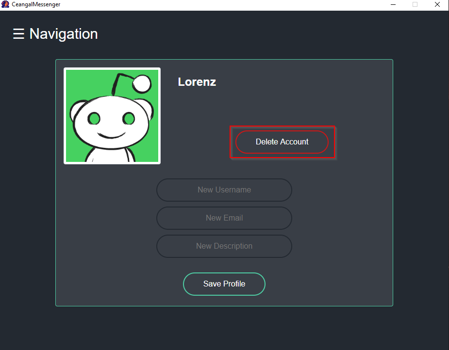
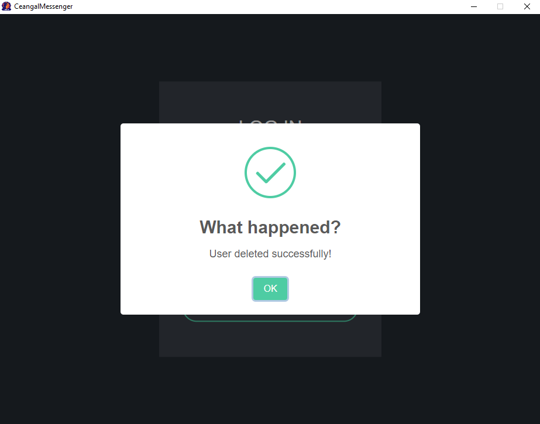

# 1 Use-Case Specification: Delete account

## 1.1 Brief Description

Delete the user account completely, so the database entry gets removed.

## 1.2 Mockup/Screenshot

# 2 Flow of Events

## 2.1 Basic Flow

- User clicks on "Edit profile" button
- Redirect to "Edit profile" page
- User clicks on button "Delete account"
- A formula opens with a field for username and password
- User has to enter email and password and press "Delete account"
- Dialog with text "Do you really want to delete your account?" and options "Continue" and "Cancel" is shown
- User clicks on "Continue"
- Account gets deleted and removed from the application
- User will be redirected to the "Log In" page with a confirmation message

### 2.1.1 Activity Diagram

### 2.1.2 .featureFile

TODO

## 2.2 Alternative Flows

(n/a)

# 3 Special Requirements

(n/a)

# 4 Preconditions

The user has to be logged in to the application.

# 5 Postconditions

All user data gets removed from the application.

# 6 Function Points

