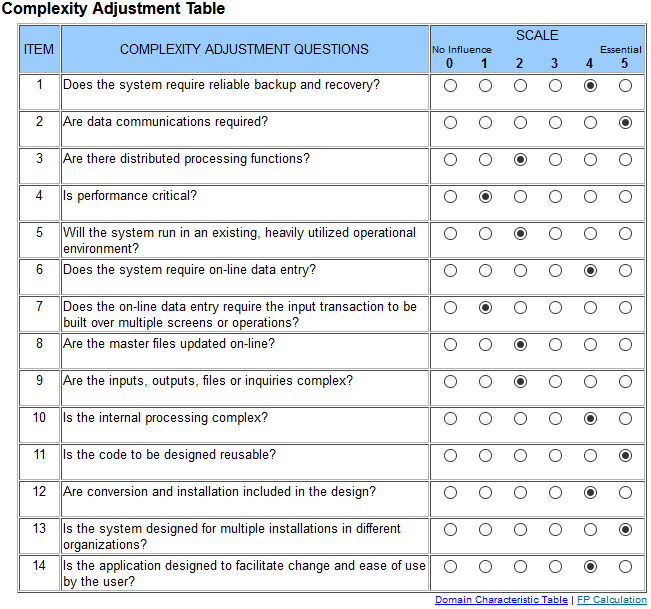

# 1 Use-Case Specification: Send private text message

## 1.1 Brief Description

The user sends a friend a private text message.

## 1.2 Mockup

TODO

## 1.3 Screenshot

TODO

# 2 Flow of Events

## 2.1 Basic Flow

- User clicks on "Friends" button
- Redirect to "Friends" page
- A list of all friends is shown
- User selects a friend
- Chat window opens with the friend
- User types message into input field
- User clicks "Enter"
- Message get send to friend

### 2.1.1 Activity Diagram

### 2.1.2 .featureFile

TODO

## 2.2 Alternative Flows

(n/a)

# 3 Special Requirements

(n/a)

# 4 Preconditions

- The user has to be logged in to the application.
- To user has to add the other as a friend.

# 5 Postconditions

The friend receives the message.

# 6 Function Points

