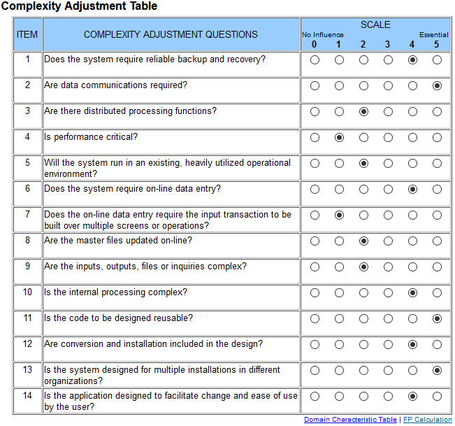

# 1 Use-Case Specification: Show friends

## 1.1 Brief Description

Shows all the friends you currently have.

## 1.2 Mockup

TODO

## 1.3 Screenshot

TODO

# 2 Flow of Events

## 2.1 Basic Flow

- User clicks on "Friends" button
- Redirect to "Friends" page
- A list is shown of all friends

### 2.1.1 Activity Diagram

### 2.1.2 .featureFile

TODO

## 2.2 Alternative Flows

(n/a)

# 3 Special Requirements

(n/a)

# 4 Preconditions

The user has to be logged in to the application.

# 5 Postconditions

The friends of the user get displayed.

# 6 Function Points

