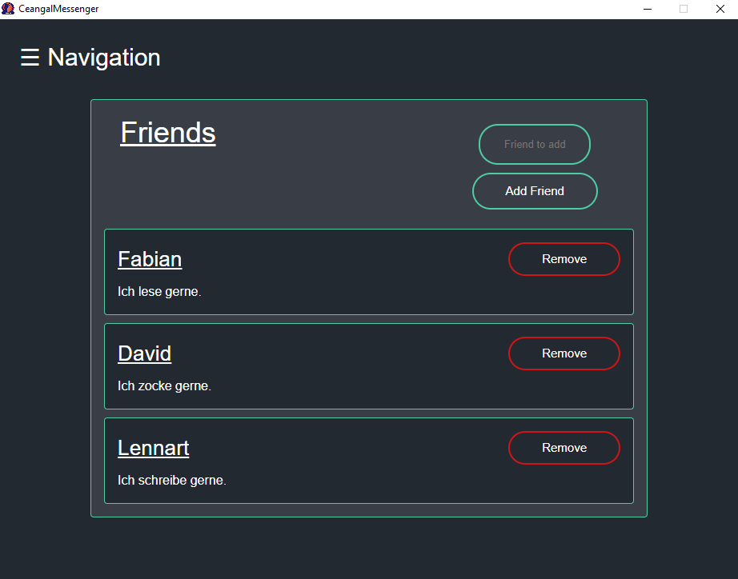

# 1 Use-Case Specification: Show friends

## 1.1 Brief Description

Shows all the friends you currently have.

## 1.2 Mockup/Screenshot



# 2 Flow of Events

## 2.1 Basic Flow

- User clicks on "Friends" button
- Redirect to "Friends" page
- A list is shown of all friends

### 2.1.1 Activity Diagram


### 2.1.2 .featureFile

[.feature File ShowFriends](https://github.com/LorenzSeufert/CeangalMessenger---Code/blob/master/Kotlin-Backend/src/test/resources/cucumber/ShowFriends.feature)

```Gherkin
Feature: ShowFriends

  Scenario: User has no friends
    Given the user is on the profile page
    And the user is logged in
    When the user clicks on the friends page in the navbar
    Then the user sees the friends page with his friend list
    When the user has no friends added
    Then no users get displayed in the friendlist


  Scenario: User has friends added
    Given the user is on the profile page
    And the user is logged in
    When the user clicks on the friends page in the navbar
    Then the user sees the friends page with his friend list
    When the user has already friends added
    Then all friends get displayed with name and description
```

## 2.2 Alternative Flows

(n/a)

# 3 Special Requirements

(n/a)

# 4 Preconditions

The user has to be logged in to the application.

# 5 Postconditions

The friends of the user get displayed.

# 6 Function Points


